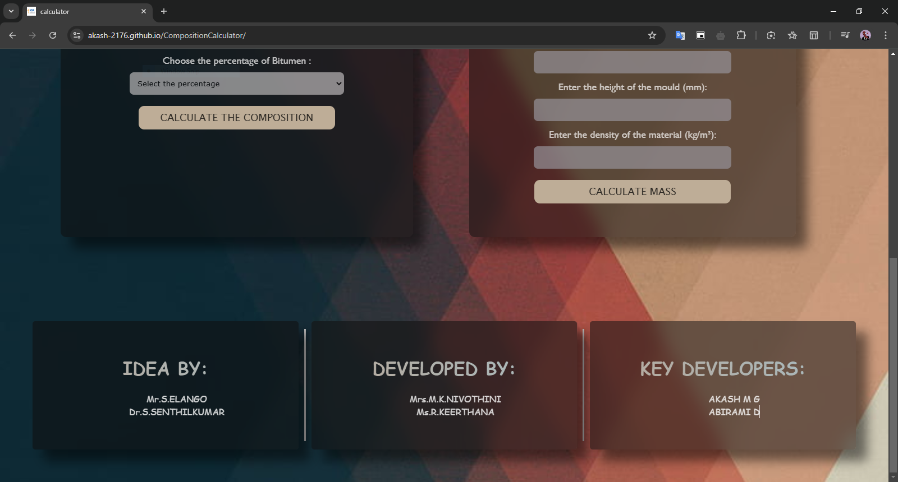

# 🛠️ Bituminous Concrete Mix Calculator

This web application calculates the proportions of bituminous concrete mixtures based on the Marshall Stability method. It enables users to determine material compositions, mass calculations, and download results in Excel format.

---

## 🌐 Features
- **Material Composition Calculator**: Select bitumen percentages to calculate the proportions of various materials like filler, fine aggregate, coarse aggregate, and plastic.
- **Mass Calculator**: Calculate the mass of the mould based on its dimensions and material density.
- **Dynamic Table Updates**: View material proportions and weights in a structured table.
- **Downloadable Results**: Export the results as an Excel file.
- **Guided Standards**: Data based on Highway Research Board standards.

---

## 🛠️ Technologies Used
- **HTML**: Structure the web app.
- **CSS**: Style the user interface.
- **JavaScript**: Handle calculations and dynamic content.
- **Libraries**:
  - [XLSX.js](https://github.com/SheetJS/sheetjs) for generating Excel files.
  - [FileSaver.js](https://github.com/eligrey/FileSaver.js/) for downloading files.

---

## 📋 How to Use
1. Open the app in a web browser.
2. **Material Composition**:
   - Choose the percentage of bitumen.
   - Click "Calculate the Composition" to view material distribution in a table.
   - Download the results as an Excel file by clicking "Download."
3. **Mass Calculation**:
   - Enter the mould diameter, height, and material density.
   - Click "Calculate Mass" to view the results.
4. View updated data in real-time.

---

## 📚 Data Standards
This app adheres to the following standards for material proportions:
- **Bitumen**: 4–9% (IS 73:2013).
- **Filler**: 3–8% (I.S. 3812 (Part I)-1969).
- **Fine Aggregate**: 15–40% (IS: 383-1970).
- **Coarse Aggregate**: 45–80%.
- **Waste Plastic**: 6–8% (IRC: SP:98-2013).

---

## 📦 Setup for Local Use
1. Clone the repository:
   ```bash
   git clone https://github.com/Akash-2176/CompositionCalculator.git
2. Navigate to the project folder:
   ```bash
   cd CompositionCalculator
3. Open **index.html** in your web browser.

## 📊 Screenshots




---

## 👥 Team
### Idea By:
- Mr. S. Elango
- Dr. S. Senthilkumar
### Developed By:
- Mrs. M.K. Nivothini
- Ms. R. Keerthana
### Key Developers:
- [Akash 😉](https://github.com/Akash-2176)
- [Abirami D](https://github.com/Abiingit)

---

## 📖 License

This project is licensed under the MIT License. See the [LICENSE](LICENSE.txt) file for details.

---

## 📞 Contact

For any inquiries or issues, feel free to reach out:
- **Author:** Akash 😉
- **Email:** akashthewarrior2176@gmail.com
- **GitHub:** [Akash-2176](https://github.com/Akash-2176)

---
